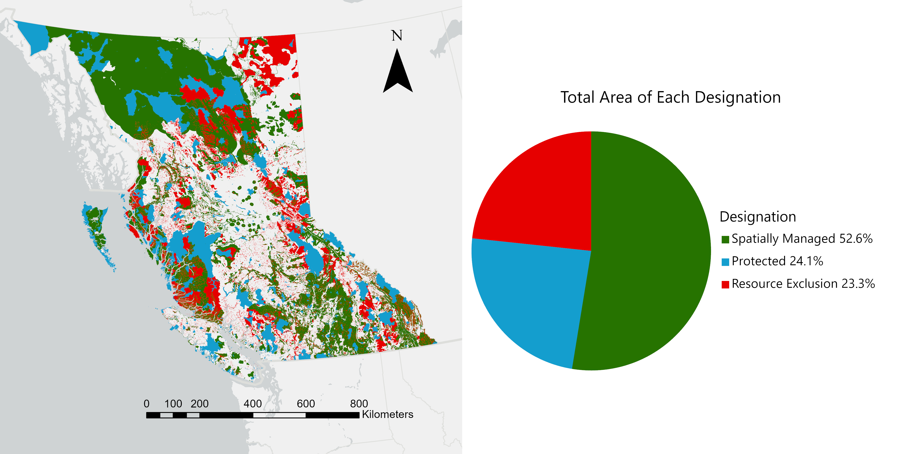
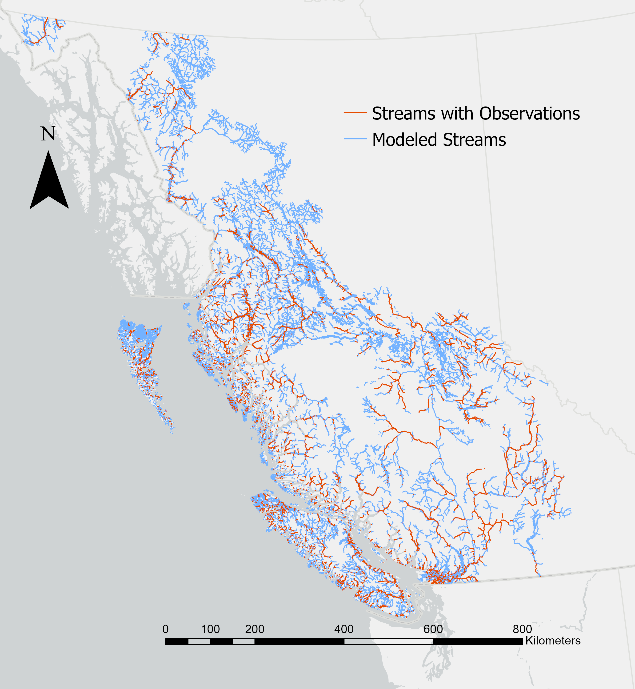
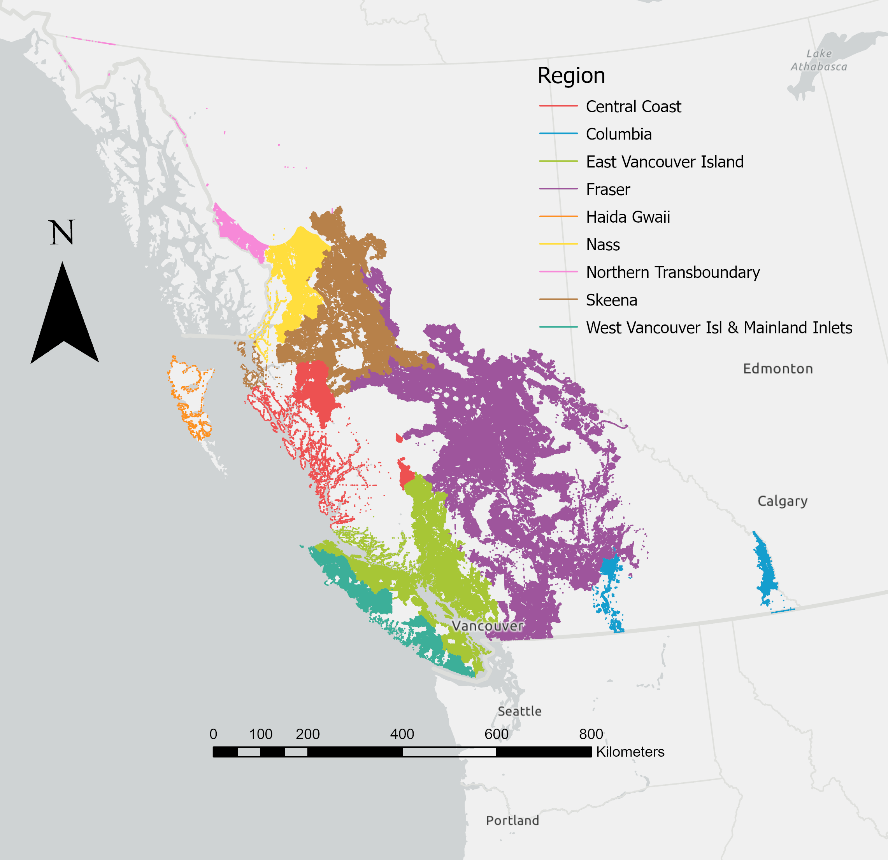
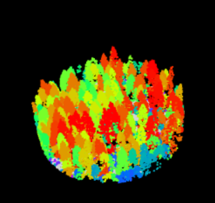
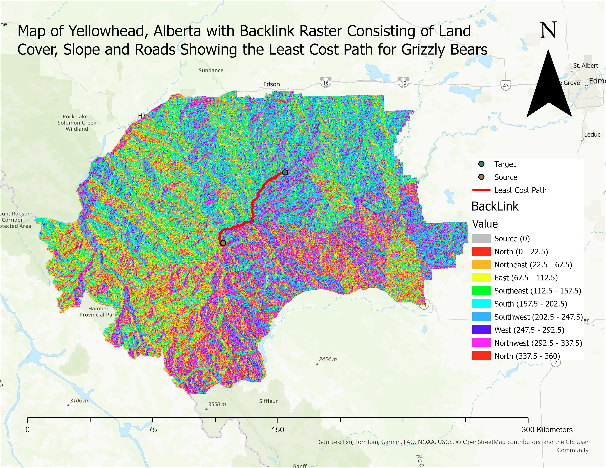
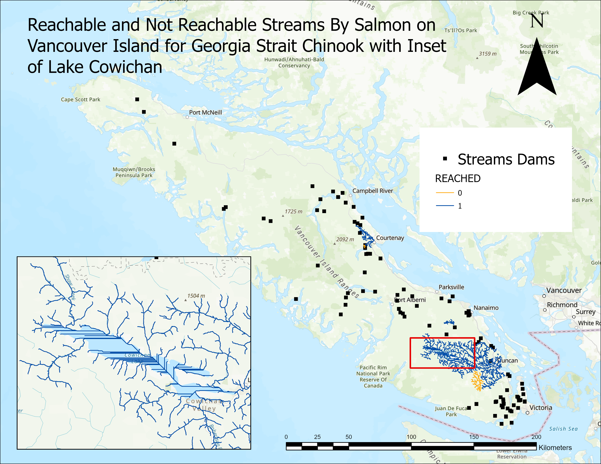

# MGEM Capstone project (FCOR 599):   
- in progress

Investigating the Intersection of Modeled and Observed Pacific Salmon Streams with Conserved and Protected Areas in British Columbia.

My capstone project uses stream layers from the GitHub repository [bcfishpass](https://smnorris.github.io/bcfishpass/) which represent modeled and observed spawning and rearing streams and migration paths for Pacific salmon species across BC. I am intersecting these streams with conserved and protected layers so see which salmon species and regions across BC have these modeled and observed streams. This information will allow conservationists to determine which Pacific salmon species could have access to conserved and protected areas. This will also allow for the potential to introduce Pacific salmon to these areas allowing for increased habitat connectivity and improve the stability of these populations in BC.    

{fig-align="left"}  

{width=50% fig-align="left"}    

{width=50% fig-align="left"}    

# Code Snippets

Below is a SQL code snippet that I am using to create the intersections of streams and conserved and protected areas.

::: {.panel-tabset group="language"}
## SQL

``` (.r)
CREATE TABLE streams_in_conserved AS
SELECT
    -- bcfishpass stream data
    s.fid,
    s.length_metre,
    s.spawning_ch,
    s.spawning_cm,
    s.spawning_co,
    s.spawning_pk,
    s.spawning_sk,
    s.spawning_st,
    s.rearing_ch,
    s.rearing_sk,
    s.rearing_st,
    s.rearing_co,
    s.watershed_group_code,

    -- conserved and protected areas (all columns, already preprocessed)
    c.objectid AS conserved_id,
	  c.harvest_restrictions_id,
    c.land_designation_name,
  	c.land_designation_type_rank,
	  c.designation,
  	c.harvest_restriction_class_rank,
  	c.harvest_restriction_class_name,
  	c.og_restriction,
  	c.mine_restriction,
  	c.shape_area,
  	c.shape_length,
  	c.overall_desig

FROM bcfishpass_stream s
JOIN conserved_areas_processed c
  ON s.geom && c.SHAPE     
 AND ST_Intersects(s.geom, c.SHAPE);
```
:::

# Assignments

Through the various assignments in MGEM, I have gained hands-on experience in addressing environmental management issues using GIS, remote sensing, statistics and landscape ecology. Below are some examples of assignments that highlight my learning.

[GEM 520/521:]{.underline}

{fig-align="left"}

{fig-align="left"}

[GEM 510/511:]{.underline}    

{width=60% height=60% fig-align="left"}

{width=60% height=60% fig-align="left"}
