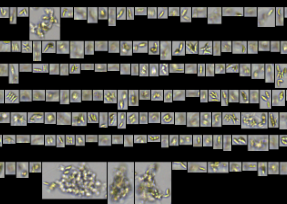

Below are projects I have undertaken or been a part of through my work experience and education.

# *Projects:*

[Contaminant Atlas](https://marinedata.psf.ca/atlases/contaminants-atlas/)

- The Contaminant Atlas is a geospatial database run by the Pacific Salmon Foundation - It contains information on marine contaminant samples that are harmful to Pacific salmon. 
- I maintained this database through extracting and updating existing information on historical reports.

[Undergraduate Directed Studies:]{.underline} 

Effects of microplastics on *Scenedesmus obliqqus* aggregation

- I designed and performed an experiment to investigate phytoplankton aggregation in response to microplastic exposure over time. 
- I utilized the Flowcam to capture images of phytoplankton.

{fig-align="left"}

# *Publications:*

Ogushi, R., Sun, E., Campbell, L. R. E., Chandrakumar, F. B., Fort, R., Graham, N., Grebert, J., Grewal, O., Habib, I., Hamamoto, S. C., Ho, K., Huang, Y., Kim, A., Manocha, N. K., Pandher, K., Radakovich, E., Raghuraman, S., Read, T., Roh, S. T., … Tseng, M. (2024). Lepidoptera species richness and community composition in urban street trees. Canadian Journal of Zoology, 102(6), 556–564. https://doi.org/10.1139/cjz-2023-0150

       
